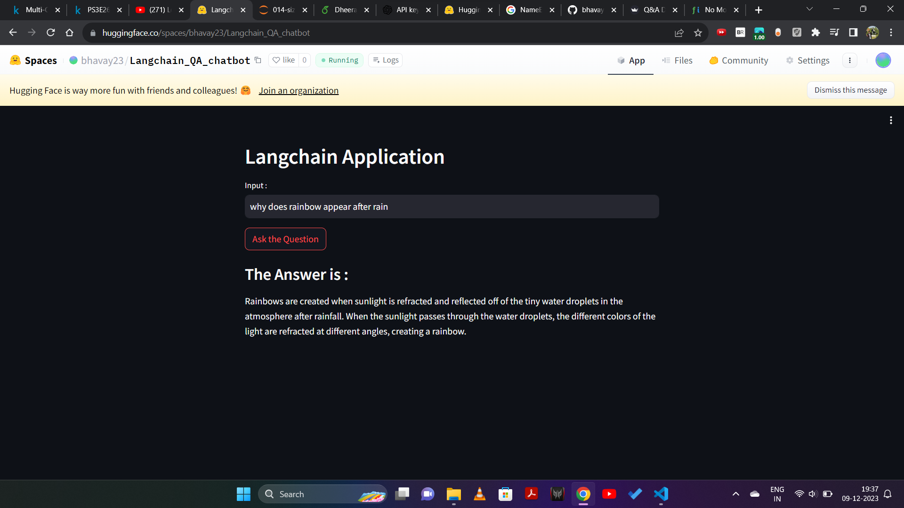
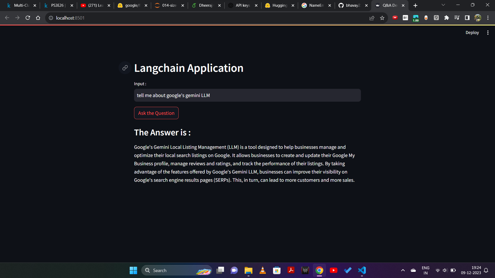

##CHATBOT
 An interactive and intelligent chatbot using the Language Model (LLM) capabilities. This chatbot is designed to understand and respond to user queries, providing a natural language interface for various applications.


## Features
-Leverages the power of OpenAI's advanced language model to understand and generate human-like responses.
- Receives user input through a Streamlit web application, creating an accessible and intuitive interface.
- Deployed on Streamlit for a seamless and user-friendly web-based experience.
- Allows for a personalized and context-aware interaction with users.

## Project Structure

- app.py: The main Streamlit application script.
- requirements.txt: A list of required Python packages for the project.
-langchain.ipynb : Contains relavent information of LLMs
- .env: Configuration file for storing your OpenAI API key.

## Installation

1.Clone this repository to your local machine using:

```bash
  https://github.com/bhavay23/ChatBot_using_LLM
```
2.Navigate to the project directory:

```bash
  cd BreadcrumbsNews_research_app_using_LLM
```
3. Install the required dependencies using pip:

```bash
  pip install -r requirements.txt
```
4.Set up your OpenAI API key by creating a .env file in the project root and adding your API

```bash
  OPENAI_API_KEY=your_api_key_here
```
5. Run the Streamlit App:
```bash
  streamlit run app.py
```
